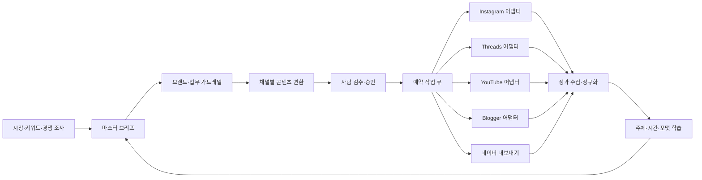

# SNS 채널 자동화 솔루션 분석 및 개발 설계

작성 기준일: 2026-08-25  
분석 대상: `pslab-alwayson-brochure.pdf` 26쪽  
구현 결과: BrandFlow Always-On MVP 0.1

## 1. 결론부터: 이 제품의 본질

브로슈어가 제안하는 것은 단순한 “SNS 예약 발행기”가 아닙니다. 본질은 다음 다섯 기능을 하나의 운영체계로 묶는 **브랜드 콘텐츠 운영 OS**입니다.

1. 시장·키워드·경쟁 계정에서 주제를 찾는다.
2. 하나의 전략 메시지를 채널 문법에 맞게 다르게 만든다.
3. 정해진 시간에 반복 발행하고 실패를 알린다.
4. 콘텐츠와 채널 성과를 한 화면에서 본다.
5. 반응이 좋았던 주제·시간·표현을 다음 제작에 반영한다.

광고 전문가 관점에서 가장 영리한 포지셔닝은 “유료 광고 대체”가 아니라 **광고가 꺼져도 남는 검색·콘텐츠 자산을 쌓아 고객 획득 비용을 보완한다**는 점입니다. 고객 여정을 `발견 → 검색 → 확신 → 전환`으로 나눈 뒤 Instagram·Threads는 발견과 친밀감, 네이버·Google 글은 검색과 확신, YouTube Shorts는 발견과 반복 노출에 배치합니다.

다만 브로슈어에 등장하는 비용 절감액, 참여율, 시간대, 연간 콘텐츠 수치는 사례 화면 또는 판매 주장입니다. 산식·대조군·표본 수·측정 기간이 제시되지 않았으므로 성과 근거로 확정하면 안 됩니다. 개발 제품에서는 이런 숫자를 기본값으로 약속하지 않고 고객별 기준선과 실험으로 검증해야 합니다.

## 2. 브로슈어 26쪽 기능 해부

| 구간 | 브로슈어의 역할 | 제품 요구사항으로 번역 |
|---|---|---|
| 1-3쪽 | 솔루션 정의, 16년 업력, 산업 포트폴리오 | 신뢰 형성. 소프트웨어 기능이 아니라 서비스형 운영·전문가 검수의 근거 |
| 4쪽 | 발견·검색·확신·전환 여정 | 채널이 아니라 퍼널 목적에서 콘텐츠를 기획하는 모델 필요 |
| 5-6쪽 | 인력비, 운영 중단, 시작 지연의 고통 | 무인 반복, 실패 알림, 짧은 온보딩이 구매 이유 |
| 7쪽 | 조사 → 제작 → 5채널 발행 → 학습 | 전체 제품의 핵심 워크플로와 상태 머신 |
| 8쪽 | SEO에서 GEO로 확장 | 키워드뿐 아니라 질문·개체·근거·일관된 브랜드 답변 관리 필요 |
| 9쪽 | 시장·경쟁사·브랜드 조사 | 검색 데이터 수집, 경쟁 콘텐츠 라이브러리, 브랜드 가드레일 필요 |
| 10-11쪽 | 통합 대시보드와 상세 보기 | 콘텐츠 관제, 상태·일정·성과, 원고·소재·수정·다운로드 기능 필요 |
| 12-14쪽 | Instagram 캐러셀 | 한 문장 훅, 3-6장 핵심, 마지막 결론·CTA, 저장·공유 최적화 |
| 15-16쪽 | 네이버 장문 SEO | 검색 의도, 제목·본문 구조, 키워드 지수, 장기 노출 추적 |
| 17쪽 | Google Blogger 아티클 | 깊이 있는 글, 대표 이미지, 해외·Google 검색 유입 |
| 18쪽 | Threads | 짧고 빠른 인사이트, 질문형 CTA, 대화와 친밀감 |
| 19-20쪽 | YouTube Shorts | 훅 → 핵심 → 행동 유도, 자막·배경·음악, 신규 도달 |
| 21-22쪽 | 예약과 Telegram 알림 | 반복 스케줄러, 실패 알림, 발행 링크, 주간 리포트 |
| 23쪽 | 주제·시간·디자인 학습 | 성과 특징 추출, 추천과 신뢰도, 다음 제작 입력으로 회수 |
| 24-25쪽 | 비용 환산과 복리 효과 | ROI 대시보드, 누적 콘텐츠 자산, 시간 절감 추적 |
| 26쪽 | 월 고정비·5채널·자동·검색/AI 요약 | 가격·범위·차별점을 한 문장으로 요약하는 판매 페이지 |

## 3. 강점과 허점

### 잘 설계된 점

- **고객의 운영 고통을 정확히 겨냥합니다.** 콘텐츠 품질보다 먼저 “매일 다섯 채널을 열어야 하는 일”을 없애겠다고 말합니다.
- **한 화면의 관제 경험을 팝니다.** 제작 결과만이 아니라 상태·일정·성과·수정 흐름을 묶어 운영 불안을 줄입니다.
- **채널별 포맷을 구체적으로 보여줍니다.** 막연한 AI 자동화보다 결과물을 상상하기 쉽습니다.
- **서비스와 소프트웨어를 결합합니다.** 15년 이상 전문가가 초기 브랜드 방향을 잡고 그 뒤 자동화한다는 설명은 순수 SaaS의 품질 불안을 줄입니다.
- **성과의 복리성을 강조합니다.** 광고비가 끝나면 노출이 끝나는 구조와 검색에 남는 콘텐츠의 누적 구조를 대비합니다.

### 보완해야 할 점

- “5채널 동시 발행”이라는 문구는 API 현실을 단순화합니다. 플랫폼마다 계정 유형, 권한 심사, 미디어 URL, 쿼터, 감사 조건이 다릅니다.
- 네이버 블로그의 로그인 기반 글쓰기 Open API는 2020년 종료됐습니다. 공식 자료는 종료 이유로 반복적·기계적인 유사 글 대량 발행 등 정책 위반을 명시합니다. 따라서 네이버는 공식 검색 API를 조사에 쓰고, 게시 단계는 검수 가능한 내보내기로 두는 것이 안전합니다. [네이버 공식 종료 공지](https://developers.naver.com/notice/article/7527), [네이버 블로그 검색 API](https://developers.naver.com/docs/serviceapi/search/blog/blog.md)
- “AI가 추천한다”는 설명에는 데이터 최소량, 신뢰도, 대조군이 없습니다. 성과가 적은 신규 계정에서는 규칙 기반 추천과 업종 기준값부터 시작해야 합니다.
- 같은 메시지를 채널마다 그대로 복제하면 도달 저하, 독자 피로, 중복 콘텐츠 문제가 생깁니다. 중심 아이디어만 공유하고 훅·분량·증거·CTA는 채널별로 바꿔야 합니다.
- 자동 발행 전에 법무·표현·저작권 검수가 필요합니다. 특히 의료·건강·금융·아동·비교 광고는 사람 승인 없이는 운영하면 안 됩니다.

## 4. 광고 전문가의 운영 전략

### 4.1 채널의 역할

| 채널 | 주 역할 | 추천 포맷 | 핵심 KPI |
|---|---|---|---|
| Instagram | 발견·저장·브랜드 기억 | 6장 캐러셀, Reels | 도달, 저장률, 공유율, 프로필 이동 |
| 네이버 블로그 | 국내 검색·확신 | 문제 해결형 장문 | 검색 노출, 비브랜드 클릭, 체류, 문의 |
| Google Blogger | Google 검색·영문/해외 확장 | 깊이 있는 아티클 | 유기 클릭, 검색 질의, 보조 전환 |
| Threads | 친밀감·대화·빠른 관점 | 짧은 주장+질문 | 답글률, 인용, 팔로우 전환 |
| YouTube Shorts | 신규 도달·메시지 반복 | 5-15초 훅 중심 영상 | 유효 조회, 평균 시청, 반복 재생, 구독 |

### 4.2 콘텐츠 제작 원칙

- **마스터 브리프에는 한 가지 고객 문제만 둡니다.** 주제가 넓으면 다섯 채널 모두 평범해집니다.
- **각 채널은 복사가 아니라 파생물입니다.** Instagram은 저장, Threads는 답글, 검색 글은 문제 해결, Shorts는 시청 지속을 목표로 씁니다.
- **CTA는 퍼널 단계와 일치해야 합니다.** 발견 단계에서 바로 구매를 요구하기보다 저장·팔로우·질문으로 다음 접점을 만듭니다.
- **AI 초안과 사실 검증을 분리합니다.** 제품 사실, 가격, 통계, 경쟁 비교는 승인된 지식베이스에서만 가져옵니다.
- **성과 학습은 평균보다 세그먼트로 봅니다.** 채널·주제·포맷·퍼널·요일·시간대별로 나누고 최소 표본 미달이면 추천을 보류합니다.

### 4.3 북극성 지표와 가드레일

북극성 지표는 단순 발행 건수가 아니라 `승인된 콘텐츠 1건당 30일 누적 유효 행동`이 적합합니다. 유효 행동에는 저장·공유·답글·검색 클릭·리드·보조 전환을 가중 합산합니다.

필수 운영 지표:

- 발행 성공률 = 완료 작업 / 실행 작업
- 승인 리드타임 = 초안 생성부터 승인까지 걸린 시간
- 재작업률 = 승인 전 두 번 이상 수정된 콘텐츠 비율
- 채널별 유효 행동률 = 유효 행동 / 도달 또는 조회
- 검색 자산 성장 = 30일 이상 유기 클릭을 만든 문서 수
- 절감 시간 = 과거 수작업 기준시간 - 실제 검수·수정시간
- 콘텐츠 기여 리드 = UTM·전환 이벤트로 연결된 문의 수

가드레일:

- 정책 위반·저작권 신고 0건
- 사실 오류·수정 공지율
- 실패·중복 게시율
- 토큰·렌더링·저장소 비용/콘텐츠
- 고객별 발행 빈도 상한과 야간 금지 시간

## 5. 실제 API 가능 범위

| 채널 | 공식 자동 발행 | 주요 제약 | 제품 설계 |
|---|---|---|---|
| Instagram | 가능 | 프로페셔널 계정, 게시 권한, 공개 미디어 URL, 24시간 이동 구간 게시 한도 | 컨테이너 생성·상태 확인·최종 게시를 별도 작업으로 관리. [Meta 공식 Instagram 컬렉션](https://www.postman.com/meta/instagram/documentation/6yqw8pt/instagram-api) |
| Threads | 가능 | Meta 앱의 Threads 유스케이스, OAuth, 컨테이너 생성 후 게시 | 텍스트·이미지·영상·캐러셀 어댑터 분리. [Meta 공식 Threads 컬렉션](https://www.postman.com/meta/threads/documentation/dht3nzz/threads-api) |
| YouTube | 가능 | OAuth, 영상 파일, resumable 업로드, 미감사 프로젝트 업로드는 비공개 제한 | 렌더·업로드·처리 완료를 분리하고 지수 백오프. [videos.insert](https://developers.google.com/youtube/v3/docs/videos/insert) |
| Google Blogger | 가능 | OAuth `blogger` 범위와 blogId | `posts.insert`로 초안 생성 후 예약 시 `posts.publish`. [posts.insert](https://developers.google.com/blogger/docs/3.0/reference/posts/insert), [posts.publish](https://developers.google.com/blogger/docs/3.0/reference/posts/publish) |
| 네이버 블로그 | 공식 글쓰기 API 없음 | 2020년 로그인 방식 글쓰기 API 종료 | 검색 API로 조사·모니터링, 게시 원고는 사람에게 내보내기 |

성과 수집은 Instagram Media Insights, YouTube Analytics, Threads 인사이트, UTM/사이트 분석을 정규화해 `impressions`, `reach`, `views`, `engagements`, `clicks`, `leads`의 공통 지표와 채널 고유 지표를 함께 저장해야 합니다. YouTube Analytics는 OAuth 승인 요청으로 기간·지표·차원·필터를 지정할 수 있습니다. [YouTube Analytics reports.query](https://developers.google.com/youtube/analytics/reference/reports/query)

## 6. 제품 아키텍처

생산 환경 권장 구성:

- 웹/API: TypeScript + Fastify 또는 NestJS
- 데이터: PostgreSQL, 객체 저장소, Redis
- 작업 실행: 지연 큐 + 채널별 워커 + 멱등성 키
- 인증: 조직별 OAuth 연결, 토큰 암호화, 최소 권한
- 렌더링: 템플릿 버전이 있는 이미지·영상 렌더 서비스
- 관측성: 구조화 로그, 작업 추적 ID, 실패율·지연 경보
- 분석: 이벤트 웨어하우스와 채널 인사이트의 일별 스냅샷
- AI: 공급자 추상화, 지식베이스 검색, 근거 저장, 프롬프트·모델 버전 기록

핵심 상태 머신:

`draft → review → approved → scheduled → publishing → published`

예외 분기:

- 일시 오류: `publishing → retrying → publishing`
- 영구 오류: 재시도 한도 초과 후 `failed`
- 공식 게시 API 없음: `scheduled → awaiting_manual_publish`
- 수정 발생: 기존 작업 취소 후 새 버전으로 재승인

중복 게시를 막기 위해 `(tenant_id, content_version_id, channel, scheduled_slot)`에 고유 멱등성 키를 둬야 합니다.

## 7. 이번 MVP에 구현한 범위

- Node.js 표준 라이브러리만 사용한 로컬 서버와 REST API
- 마스터 브리프를 5개 채널 포맷으로 변환하는 콘텐츠 엔진
- 브랜드 적합도·명료성·독창성·위험 점수
- 검수 승인 게이트
- 채널별 예약 작업과 30초 간격 분산
- 발행 중·완료·재시도·실패·수동 게시 대기 상태
- 15초 주기 스케줄러와 수동 즉시 실행
- 공식 API/수동 내보내기 기능 경계를 보여주는 커넥터 화면
- 성과·시간대·추천 대시보드
- 모바일 반응형 UI
- 핵심 도메인 자동 테스트 5개

의도적으로 제외한 것:

- 실제 계정 OAuth 연결과 외부 게시
- LLM 호출과 이미지·영상 생성
- 실제 플랫폼 성과 데이터 수집
- 다중 조직·과금·권한 관리
- 네이버 비공식 자동 조작

이 제외 항목은 누락이 아니라 자격증명·심사·브랜드 자료 없이 외부 계정에 영향을 주지 않기 위한 안전한 MVP 경계입니다.

## 8. 제품화 로드맵

### 0단계: 전략 기준 확정, 2-3일

- 대상 업종과 대표 고객 한 유형 확정
- 브랜드 보이스·금칙어·승인자·채널 우선순위 정의
- 최근 90일 기준선: 제작시간, 발행량, 도달, 검색 클릭, 리드 확보

### 1단계: 운영 코어, 1-2주

- PostgreSQL·조직·사용자·권한 모델
- 콘텐츠 버전, 승인, 예약, 작업 로그
- 공개 미디어 저장소와 Telegram/이메일 알림
- 네이버 원고·HTML·이미지 패키지 내보내기

### 2단계: 공식 채널 연결, 2-4주

- Instagram과 Threads OAuth·게시·인사이트
- Blogger 게시·예약
- YouTube 렌더·resumable 업로드·처리 상태
- 토큰 갱신, API 속도 제한, 멱등성, 재시도 정책

### 3단계: AI 제작과 가드레일, 2-3주

- 브랜드 자료 검색과 근거 있는 초안
- 채널별 프롬프트·템플릿 버전
- 사실·금칙어·유사도·저작권 점검
- 사람 수정 데이터를 학습 신호로 저장

### 4단계: 성과 학습, 3-4주

- 채널 지표 정규화와 UTM/리드 연결
- 주제·포맷·시간대별 실험
- 최소 표본과 신뢰도를 포함한 추천
- 고객별 ROI·절감 시간 리포트

## 9. 첫 실제 도입을 위한 결정 사항

다음 세 가지가 정해지면 실연동 개발로 바로 넘어갈 수 있습니다.

1. 첫 대상 브랜드와 업종, 주요 제품 또는 서비스
2. 우선 연결할 두 채널: 권장 순서는 Instagram + Threads 또는 Instagram + Blogger
3. 운영 방식: 완전 자동이 아니라 `AI 초안 → 사람 승인 → 자동 게시`를 기본으로 할지 여부

첫 파일럿은 30일이 적절합니다. 기존 운영 2주 기준선과 자동화 4주를 비교하되, 발행량만 늘리는 것이 아니라 승인 시간, 검색 클릭, 유효 행동, 리드, 정책 오류를 함께 봐야 합니다.

